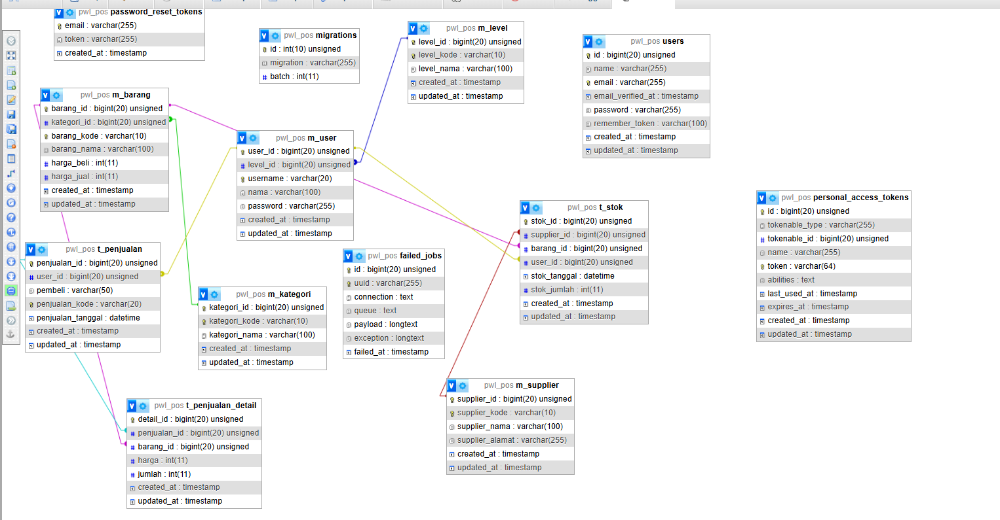
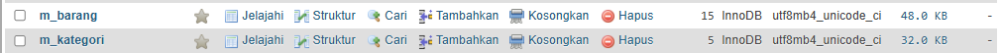
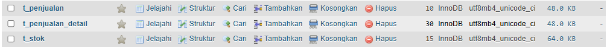
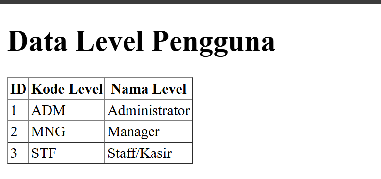
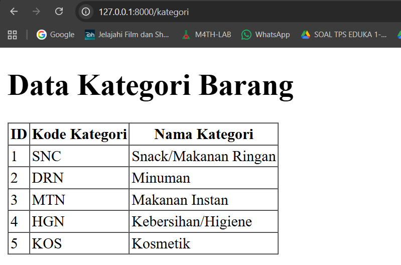
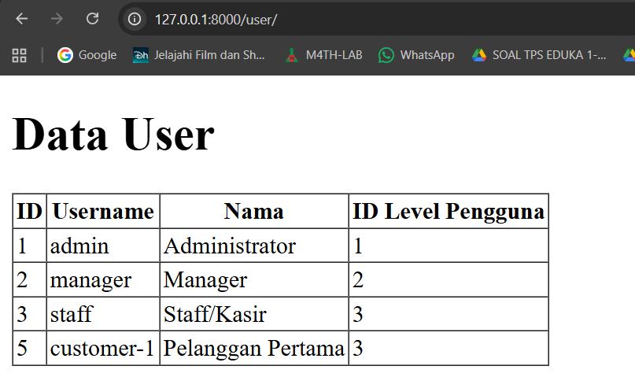

📘 Laporan Praktikum PWL-POS (Jobsheet 03)

🧱 Praktikum 2.1 — Migrasi Tanpa Relasi

Dibuat file migrasi untuk tabel m_level:

php artisan make:migration create_m_level_table

Diubah struktur migrasi dengan menambahkan kolom seperti:

level_id (primary key, auto increment)

level_kode (string)

level_nama (string)

timestamps

Jalankan perintah migrasi:

php artisan migrate

Dengan cara serupa, dibuat juga tabel m_kategori dan m_supplier.
Hasil: Ketiga tabel berhasil dibuat di database.

🔗 Praktikum 2.2 — Migrasi Dengan Relasi

Buat migrasi untuk tabel m_user:

php artisan make:migration create_m_user_table

Tambahkan foreign key dari level_id yang mengarah ke m_level.

Jalankan migrasi lagi.

Selanjutnya dibuat tabel lain yang saling berelasi, seperti:

m_barang → relasi ke m_kategori & m_supplier

t_penjualan → relasi ke m_user

t_stok → relasi ke m_barang & m_user

t_penjualan_detail → relasi ke t_penjualan & m_barang
Hasil: Semua tabel dan hubungan antar tabel berhasil terbentuk.

🌱 Praktikum 3 — Seeder

Buat seeder khusus masing-masing tabel.

php artisan make:seeder LevelSeeder

Isi data untuk tabel level seperti Admin, Manager, Staff.

Jalankan setiap seeder dengan:

php artisan db:seed --class=NamaSeeder

Jumlah data yang diisi:

Tabel	Jumlah	Keterangan
m_kategori	5	5 kategori berbeda
m_supplier	3	3 pemasok
m_barang	15	15 barang
t_stok	15	stok barang
t_penjualan	10	10 transaksi
t_penjualan_detail	30	3 item per transaksi

Hasil: Semua seeder berhasil dijalankan.

💻 Praktikum 4 — DB Facade

Buat controller LevelController.

php artisan make:controller LevelController

Tambahkan route /level untuk mengakses controller.

Percobaan operasi database dengan DB Facade:

Insert data

Update data

Delete data

Select data

Ditampilkan juga data di view level.blade.php.
Hasil: Semua operasi database (insert, update, delete, select) berhasil.

🧠 Praktikum 5 — Query Builder

Buat KategoriController dan route /kategori.

Lakukan operasi seperti:

Insert

Update

Delete

Tampilkan hasilnya di view kategori.blade.php.
Hasil: Query Builder berhasil memanipulasi data dan menampilkan hasilnya.

🚀 Praktikum 6 — Eloquent ORM

Buat model UserModel dan sesuaikan properti tabel & primary key.

Tambahkan route /user serta buat UserController.

Lakukan operasi menggunakan Eloquent:

Insert data baru

Update data

Menampilkan semua user

Menemukan user berdasarkan ID atau kondisi tertentu

Tampilkan data di view user.blade.php.
Hasil: Insert, update, dan tampilkan data berhasil melalui Eloquent ORM

